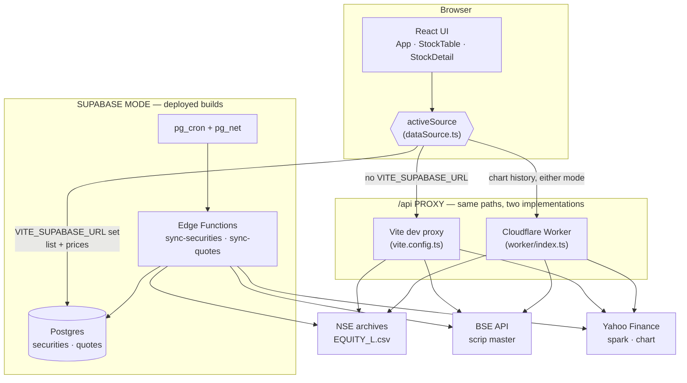
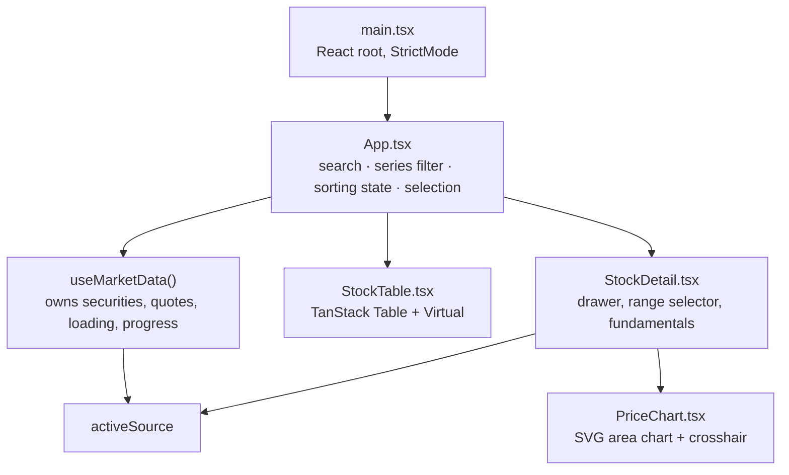

[← Docs index](README.md) · Next: [Data sources →](02-data-sources.md)

# 1. Overview & architecture

## The problem

Display every company listed on India's two cash exchanges — NSE and BSE — in one table, with live prices and history, using only free data.

Four constraints shape the entire design:

1. **No upstream sends CORS headers.** A browser cannot call NSE, BSE or Yahoo Finance directly. Something server-side must sit in between. This is not optional and it is not a preference — it is a hard browser security boundary.
2. **Both exchanges fingerprint callers.** NSE's archive endpoint returns 403 without a `Referer`, and silently *hangs* on certain browser header combinations (see [Gotchas](07-gotchas.md#1-nses-waf-hangs-on-browser-header-fingerprints)). BSE's API wants a matching `Referer` and `Origin`.
3. **The two exchange lists overlap and share no key but ISIN.** ~2,300 of BSE's 5,099 active scrips are the same companies already in NSE's list. Merging them on ISIN is what keeps the table one row per *company* instead of two rows quoting the same business — see [Data sources §2.1](02-data-sources.md).
4. **Yahoo caps price requests at 20 symbols.** ~5,200 companies ÷ 20 = **~260 requests** for one full refresh. That volume has to be batched, pooled, and streamed — you cannot do it in one call.

## The two-mode design

The app ships with two interchangeable backends behind one interface. This is the central architectural decision, and it exists to solve a real tension: Supabase is the right production answer, but requiring a Supabase project before the app shows anything makes it useless to evaluate.



Note the one line that crosses modes: **chart history is never read from Postgres.** Whichever backend supplies the list and the prices, the drawer fetches its bars live through `/api/yahoo` — the dev proxy locally, the Worker in production. Storing them cost 164 MB for data read one symbol at a time.

### How the mode is chosen

One expression, evaluated once at module load ([src/lib/dataSource.ts](../src/lib/dataSource.ts)):

```ts
export const activeSource: DataSource = isSupabaseConfigured ? supabaseSource : directSource;
```

`isSupabaseConfigured` is simply whether both `VITE_SUPABASE_URL` and `VITE_SUPABASE_ANON_KEY` are present. Supabase wins when configured, because in a production build the Vite proxy does not exist and direct calls would be blocked by CORS.

### Why this works cleanly

Both adapters implement the same interface ([src/types.ts](../src/types.ts)):

```ts
export interface DataSource {
  readonly kind: 'direct' | 'supabase';
  listSecurities(): Promise<Security[]>;
  fetchQuotes(targets: QuoteTarget[], onBatch?: (batch: Quote[]) => void): Promise<Quote[]>;
  fetchCandles(ticker: string, range: ChartRange): Promise<Candle[]>;
}
```

`QuoteTarget` is `{ symbol, ticker }`: the display key the table joins on, and the exchange-qualified Yahoo ticker to ask for. They differ for every BSE-only row, so neither can be derived from the other.

No component imports `directSource` or `supabaseSource`. They import `activeSource`. Switching backends is an env var, not a code change, and no UI component contains a branch on which mode is running.

The one place mode is visible to the user is a status pill reading "Direct (dev proxy)" or "Supabase" — deliberate, so you can always tell what you are looking at.

## Mode comparison

| | Direct | Supabase |
|---|---|---|
| Setup required | none | project + CLI + migrations + deploy |
| Works in `npm run dev` | ✅ | ✅ |
| Works in `npm run build` | ❌ (no proxy exists) | ✅ |
| Where batching happens | browser | Edge Function |
| Requests the browser makes | 121 | 2 |
| First prices visible | ~4s | immediate (pre-ingested) |
| Full market | ~19s | immediate |
| Price freshness | live at page load | as fresh as the last cron run (5 min) |

## Component map



### Who owns what state

| State | Lives in | Why there |
|---|---|---|
| `securities`, `quotes`, `loading`, `quoteProgress`, `error`, `lastUpdated` | `useMarketData` | Fetched data with a lifecycle; one owner avoids duplicate network calls |
| `search`, `series`, `sorting`, `selected` | `App` | View state that several children read; `App` is their nearest common parent |
| `range`, `candles` (per stock) | `StockDetail` | Scoped to one open drawer; discarded on close, so hoisting it would leak |
| `hover` (crosshair position) | `PriceChart` | Pure interaction state, never read by anyone else |

The rule applied throughout: state lives at the **lowest** node that can serve every reader. Nothing is lifted "just in case".

## Library choices

| Library | Why this one |
|---|---|
| **Vite** | Its dev-server proxy is what makes zero-setup mode possible. Pinned to v5 because Vite 7 requires Node 20+ and this machine runs Node 18.20.3. |
| **@tanstack/react-table** | Headless — supplies sorting logic and column definitions but zero markup, so the CSS-grid row layout the virtualizer needs is unconstrained. |
| **@tanstack/react-virtual** | Not optional. ~5,200 rows × 13 columns ≈ 68,000 cells. Rendering all of them janks badly; only ~33 rows are ever in the DOM. |
| **@supabase/supabase-js** | Postgres client, RLS-aware, works against the anon key. |
| **(no chart library)** | The chart is ~150 lines of hand-written SVG in [PriceChart.tsx](../src/components/PriceChart.tsx). A charting dependency would have been larger than the entire rest of the bundle for one area chart with a crosshair. |

**Bundle:** 235.79 kB JS (72.51 kB gzipped) + 7.43 kB CSS (2.34 kB gzipped).

## Directory layout

```
├── index.html                  Vite entry
├── vite.config.ts              dev proxy — the header rewrite lives here
├── tsconfig.json               strict; includes src/ and vite.config.ts
├── .env.example                the two vars that switch modes
│
├── src/
│   ├── main.tsx                React root
│   ├── App.tsx                 layout, toolbar, filters, status bar
│   ├── types.ts                Security · Quote · Candle · DataSource
│   ├── index.css               design tokens, light/dark, grid layout
│   ├── hooks/
│   │   └── useMarketData.ts    load orchestration + progressive quote streaming
│   ├── components/
│   │   ├── StockTable.tsx      virtualized table
│   │   ├── StockDetail.tsx     drawer
│   │   └── PriceChart.tsx      SVG chart
│   └── lib/
│       ├── dataSource.ts       adapter selection
│       ├── listings.ts         NSE + BSE master lists, merged on ISIN
│       ├── directSource.ts     NSE + BSE + Yahoo via the /api proxy
│       ├── supabaseSource.ts   Postgres reads (list + prices only)
│       ├── yahooCandles.ts     chart history, fetched on demand by both
│       ├── supabaseClient.ts   client construction / null when unconfigured
│       ├── csv.ts              RFC-4180 parser
│       └── format.ts           INR formatting, chunk(), mapPool()
│
├── worker/
│   └── index.ts                Cloudflare Worker: ./dist + the /api proxy
│
└── supabase/
    ├── migrations/
    │   ├── 0001_init.sql       tables, indexes, RLS, view
    │   ├── 0002_cron.sql       pg_cron + pg_net schedules
    │   ├── 0003_price_time.sql vendor price timestamp
    │   └── 0004_drop_candles.sql  removes the stored history
    └── functions/
        ├── _shared/upstream.ts shared helpers
        ├── sync-securities/    NSE + BSE lists, merged → securities
        └── sync-quotes/        Yahoo spark → quotes
```

---

Next: [Data sources →](02-data-sources.md)
