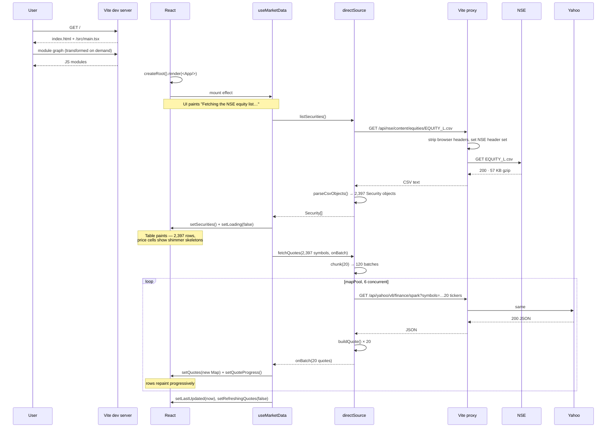
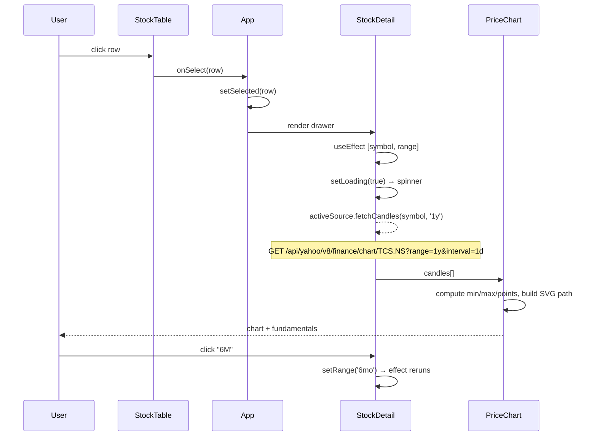
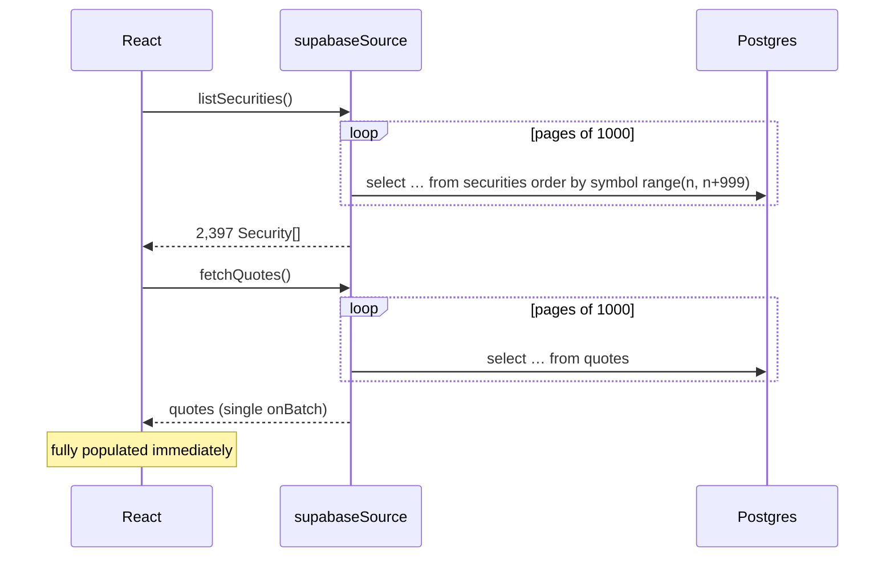

[← Data sources](02-data-sources.md) · [Docs index](README.md) · Next: [Frontend internals →](04-frontend.md)

# 3. Boot flow

Exactly what happens between `npm run dev` and a fully painted table, in order, with real timings.

## 3.1 The whole sequence



## 3.2 Measured timeline

Cold load in Chromium, direct mode, full 2,397-share market:

| Time | State |
|---|---|
| 0.0s | Navigation starts |
| ~0.4s | Vite serves `index.html`; module graph requested |
| ~1.5s | React mounts. Screen shows spinner: *"Fetching the NSE equity list…"* |
| ~2.5s | `EQUITY_L.csv` parsed. **Table paints all 2,397 rows** with shimmer placeholders in price cells |
| **~4s** | **First prices visible.** Progress bar 18%, breadth counter starts moving |
| ~7s | 60% |
| ~10s | 77% |
| ~13s | 98% |
| **~19s** | **Complete.** "Prices updated 11:50:19 am", 1,069 advancing · 1,286 declining |

The table is interactive — sortable, searchable, scrollable — from ~2.5s. Prices filling in do not block anything.

> The 4s figure depends on `onBatch` firing *inside* the worker. Firing it after the pool drains pushes first paint to ~45s. See [Gotchas §2](07-gotchas.md#2-progressive-loading-that-wasnt-progressive).

## 3.3 Stage by stage

### Stage 1 — Vite serves the app

`npm run dev` starts Vite on port 5173. No bundling; modules are transformed on request. `index.html` contains only:

```html
<div id="root"></div>
<script type="module" src="/src/main.tsx"></script>
```

### Stage 2 — React mounts

[main.tsx](../src/main.tsx) creates the root inside `<StrictMode>`. **In development, StrictMode deliberately double-invokes effects** — mount, unmount, mount. Every effect in this app is written to survive that; see §3.7.

### Stage 3 — `useMarketData` fires

Mount effect calls `activeSource.listSecurities()`. Until it resolves, `loading === true` and `App` renders the centred spinner instead of the table.

### Stage 4 — The proxy rewrites headers

The browser's `fetch('/api/nse/...')` is same-origin, so no CORS and no preflight. Vite matches the `/api/nse` prefix, and the `proxyReq` hook runs:

```ts
for (const name of proxyReq.getHeaderNames()) {
  if (!PRESERVED_HEADERS.has(name.toLowerCase())) proxyReq.removeHeader(name);
}
for (const [key, value] of Object.entries(headers)) proxyReq.setHeader(key, value);
```

Only `host`, `connection`, `content-length` survive; everything else is replaced. `rewrite` strips the `/api/nse` prefix, `changeOrigin: true` sets the `Host` header to `nsearchives.nseindia.com`.

**This replacement is load-bearing.** Merging instead of replacing leaves Chromium's `referer` + `sec-ch-ua` + `user-agent` in place, and NSE's WAF hangs on that combination.

### Stage 5 — CSV → objects

`parseCsvObjects()` walks the text character by character tracking quote state, splits into rows, trims the header names, and zips each row into an object. Then `listSecurities()` maps to `Security[]`, applying `parseNseDate` and `toNumber`, and drops rows with an empty symbol.

### Stage 6 — Table paints without prices

`setSecurities(list)` then `setLoading(false)`. `App` joins securities to the (still empty) quotes map:

```ts
const joined = useMemo(
  () => securities.map((s) => ({ ...s, quote: quotes.get(s.symbol) })),
  [securities, quotes],
);
```

Every `quote` is `undefined`, so price cells render `<span className="skeleton" />` — the shimmer. Structure, identity and sorting on static columns all work already.

### Stage 7 — Quotes stream in

```
2,397 symbols
  → chunk(20)        → 120 batches
  → mapPool(…, 6)    → 6 in flight at a time
  → per batch: fetch → json → buildQuote × 20 → onBatch(quotes)
```

Each `onBatch` triggers:

```ts
setQuotes((prev) => {
  const next = new Map(prev);
  for (const q of batch) next.set(q.symbol, q);
  return next;   // new reference → useMemo recomputes → table repaints
});
```

A **new Map** is essential. Mutating the existing one keeps the same reference, `useMemo` skips recomputation, and nothing repaints.

### Stage 8 — Settled

`lastUpdated` is set, `refreshingQuotes` goes false, the progress bar disappears, and the "Refresh prices" button re-enables.

## 3.4 Opening a stock



Two details:

- **The drawer tracks live prices.** `App` re-looks-up the selected row from `joined` on every render, so a refresh landing while the drawer is open updates it:
  ```ts
  const selectedRow = selected ? joined.find((r) => r.symbol === selected.symbol) ?? selected : null;
  ```
- **Escape closes it**, via a `keydown` listener registered in `StockDetail`.

## 3.5 Refresh

"Refresh prices" calls `refreshQuotes()`, which re-runs `loadQuotes` over all symbols. Existing quotes stay on screen and are overwritten in place, so the table never blanks out. The `inFlight` ref rejects a second refresh while one is running, and the button is disabled meanwhile.

## 3.6 Supabase mode

Same UI, far less work in the browser:



Two behavioural differences:

- **Pagination is mandatory.** PostgREST caps responses at 1,000 rows. `fetchAll()` pages with `.range(from, from + 999)` until a short page arrives. Without it you silently get 1,000 of 2,397 shares — the kind of bug that looks like working software.
- **`fetchQuotes` ignores its `symbols` argument.** The cron job already refreshed the table; the adapter just reads it and fires `onBatch` once.

## 3.7 Surviving StrictMode

React 18 StrictMode double-invokes effects in dev. Three guards handle it:

| Guard | Purpose |
|---|---|
| `cancelled` (closure flag) | Set by the effect's cleanup. The discarded first run checks it after `await` and returns without calling `setState`. |
| `mounted` (ref) | Prevents `setState` from an in-flight batch after unmount. |
| `inFlight` (ref) | Prevents two overlapping quote refreshes — from StrictMode or from an impatient click. |

Ordering under StrictMode:

```
effect₁ setup   mounted = true
effect₂ setup   listSecurities() #1 starts
effect₁ cleanup mounted = false
effect₂ cleanup cancelled₁ = true
effect₁ setup   mounted = true
effect₂ setup   listSecurities() #2 starts

#1 resolves → cancelled₁ is true → returns, no setState, no quote fetch
#2 resolves → proceeds normally
```

Net effect: two CSV downloads in dev (harmless, ~57 KB, and visible as `nseReq=2` in the test output), one quote fetch. In a production build StrictMode does not double-invoke and there is exactly one of each.

---

Next: [Frontend internals →](04-frontend.md)
