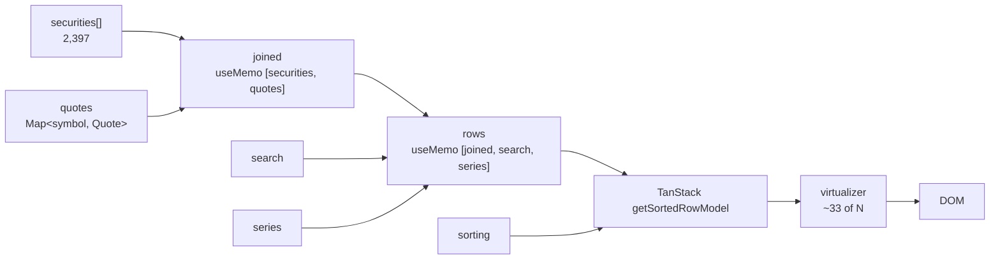

[← Boot flow](03-boot-flow.md) · [Docs index](README.md) · Next: [Supabase backend →](05-backend-supabase.md)

# 4. Frontend internals

## 4.1 Render pipeline

Every keystroke, sort click and arriving quote batch flows through the same chain:



Two `useMemo` layers matter:

- **`joined`** rebuilds 2,397 objects whenever a quote batch lands. Cheap (a spread and a Map lookup each) but it must not run on unrelated renders — hence memoisation on `[securities, quotes]`.
- **`rows`** applies search + series filtering. Recomputing this on every keystroke is fine; recomputing it when only `sorting` changed would be waste, so `sorting` is not in its dependency list — TanStack owns sorting downstream.

## 4.2 Virtualization

Without it, 2,397 rows × 11 columns ≈ **26,367 cells** in the DOM. Chrome handles that badly: multi-second initial paint, janky scrolling, and a sort click that locks the tab.

```ts
const virtualizer = useVirtualizer({
  count: tableRows.length,
  getScrollElement: () => scrollRef.current,
  estimateSize: () => ROW_HEIGHT,   // 40px, fixed
  overscan: 12,
});
```

**The maths.** At an 860px viewport the table area is ~700px ⇒ `700 / 40 ≈ 18` visible rows, plus `overscan: 12` split above and below ⇒ **~30–33 rows in the DOM**. Measured: 33. That is a **99% reduction** in DOM nodes, and it is constant regardless of whether the list holds 2,397 rows or 20.

**How rows are positioned.** A spacer div gets the full scroll height; each row is absolutely positioned and translated:

```tsx
<div className="tbody" style={{ height: virtualizer.getTotalSize() }}>   {/* 2397 × 40 = 95,880px */}
  {virtualizer.getVirtualItems().map((virtualRow) => (
    <div className="tr grid-row" style={{ transform: `translateY(${virtualRow.start}px)` }}>
```

`transform` rather than `top` keeps row movement on the compositor, off the layout path.

**Why `display: grid` instead of `<table>`.** A real `<table>` cannot have absolutely positioned `<tr>`s without breaking column alignment. Header and rows instead share one grid template in [index.css](../src/index.css):

```css
.grid-row {
  display: grid;
  grid-template-columns:
    52px 132px minmax(200px, 1.7fr) 62px 104px 96px 104px
    104px 136px 112px 66px;
  min-width: 1200px;
}
```

One declaration governs both `.thead` and every `.tr`, so they cannot drift. `min-width` forces horizontal scrolling on narrow screens rather than crushing the columns.

`contain: strict` on `.table-wrap` isolates its layout and paint from the rest of the page.

## 4.3 Sorting

### Explicit comparators

TanStack infers a comparator by sampling the first rows' values. That inference is correct with today's data, but it depends on the top rows carrying numbers — a block of unpriced symbols at the head could tip it to the alphanumeric comparator. Every numeric column therefore states its comparator:

```ts
function numericSort(a, b, columnId) {
  const av = a.getValue<number | undefined>(columnId);
  const bv = b.getValue<number | undefined>(columnId);
  if (av === undefined || Number.isNaN(av)) return bv === undefined ? 0 : 1;
  if (bv === undefined || Number.isNaN(bv)) return -1;
  return av - bv;
}
```

`listingDate` deliberately uses `sortingFn: 'text'` instead — its values are ISO `yyyy-mm-dd` strings, which sort correctly lexicographically. Applying `numericSort` there would subtract two strings and produce `NaN`.

### `undefined`, not `0`

Accessors return `?? undefined` rather than `?? 0`:

```ts
helper.accessor((r) => r.quote?.changePercent ?? undefined, { … sortUndefined: 'last' })
```

With `0`, the handful of unpriced scrips would sit in the middle of a Chg % sort pretending to be flat. With `undefined` + `sortUndefined: 'last'` they park at the bottom in both directions.

### Direction

TanStack sorts **numeric columns descending on first click**. This is the right default for a screener: one click on Chg % gives the day's top gainers.

`enableSortingRemoval: false` makes clicks cycle asc ↔ desc. The default cycle includes a third "no sorting" state that reads as a bug — the list appears to scramble back to alphabetical.

Sorting also resets scroll, or you would re-sort while halfway down and never see the rows you sorted for:

```ts
useEffect(() => { scrollRef.current?.scrollTo({ top: 0 }); }, [sorting]);
```

### Verified

| Action | Result |
|---|---|
| Chg % click 1 (▼) | `19.99, 19.99, 17.98, 14.27, …` — monotonic non-increasing ✅ |
| Chg % click 2 (▲) | `-13.04, -11.24, -10.82, -10, …` — monotonic non-decreasing ✅ |
| Chg % click 3 | back to ▼ (no "off" state) ✅ |
| LTP ▼ | MRF at ₹1,34,190 — India's most expensive share ✅ |

The two rows at exactly **+19.99%** are stocks locked at the 20% upper circuit — a good sanity check that the percentage maths is right.

### The `#` column

Rendered from `virtualRow.index + 1`, **not** `row.index`. TanStack's `row.index` is the position in the *unsorted* data, so after sorting the serial numbers would jump around (`1, 847, 23, …`). The column definition is a placeholder; the value is substituted at render:

```tsx
{cell.column.id === 'index' ? virtualRow.index + 1 : flexRender(…)}
```

## 4.4 Search and filtering

Plain substring matching across three fields, case-insensitive:

```ts
row.symbol.toLowerCase().includes(q) ||
row.name.toLowerCase().includes(q)   ||
row.isin.toLowerCase().includes(q)
```

Searching **company name** matters more than it looks — typing `RELIANCE` returns 7 rows (RCOM, RELCHEMQ, RELIANCE, RELINFRA, RHFL, RIIL, RPOWER), because the group's companies do not share a symbol prefix. Symbol-only search would find one of them.

ISIN search is exact-lookup in practice: `INE467B01029` → TCS, 1 of 2,397.

No debouncing. Filtering 2,397 objects is sub-millisecond, and virtualization means the repaint touches ~33 rows. Adding a debounce would make typing feel *worse*.

**Verified counts:** ALL 2,397 · EQ 2,075 · BE 294 · BZ 28 — matching the source CSV exactly.

## 4.5 Progressive quote loading

The single most important line in the data layer is *where* `onBatch` is called — inside the pool worker:

```ts
const results = await mapPool(batches, SPARK_CONCURRENCY, async (batch) => {
  const res = await fetch(url);
  const payload = await res.json();
  const quotes = batch.map((symbol) => buildQuote(symbol, payload[toYahooSymbol(symbol)]));
  if (quotes.length > 0) onBatch?.(quotes);   // ← here, not after the await below
  return quotes;
});
return results.flat();
```

| `onBatch` location | First prices | Full |
|---|---|---|
| After `await mapPool(...)` | ~45s (one jump) | ~45s |
| Inside the worker ✅ | **~4s** | ~19s |

Full diagnosis in [Gotchas §2](07-gotchas.md#2-progressive-loading-that-wasnt-progressive).

### `mapPool`

Bounded concurrency via a shared cursor — N workers pulling from one index, so exactly N requests are in flight and results stay index-aligned:

```ts
export async function mapPool<T, R>(items: T[], limit: number, worker: (item: T, index: number) => Promise<R>) {
  const results = new Array<R>(items.length);
  let cursor = 0;
  const runners = Array.from({ length: Math.min(limit, items.length) }, async () => {
    while (cursor < items.length) {
      const index = cursor++;
      results[index] = await worker(items[index], index);
    }
  });
  await Promise.all(runners);
  return results;
}
```

`Promise.all` over all 120 batches would fire 120 simultaneous requests; Yahoo starts refusing connections above ~8.

### Failure isolation

A failed batch returns `[]` rather than throwing. One bad chunk leaves 20 rows showing shimmer; it does not sink the other 119. Measured failures: **0 of 120**.

## 4.6 The chart

Hand-written SVG in [PriceChart.tsx](../src/components/PriceChart.tsx) — no charting dependency.

**Coordinate mapping.** Fixed `520 × 190` viewBox with padding; the SVG scales responsively via CSS while the internal coordinate system stays fixed.

```ts
x = PAD.left + (i / (points.length - 1)) * plotW
y = PAD.top  + (1 - (close - min) / span) * plotH     // y inverted: SVG y grows downward
```

`span` guards against a flat series that would divide by zero:

```ts
const span = max - min || Math.abs(max) * 0.02 || 1;
```

**Crosshair.** `getBoundingClientRect()` maps the mouse back into viewBox units — necessary because the SVG is CSS-scaled, so client pixels ≠ viewBox units:

```ts
const x = ((event.clientX - rect.left) / rect.width) * W;
```

then a linear scan finds the nearest point. At ≤260 points that is far cheaper than maintaining an index.

**Colour** is driven by the return **over the visible window**, not the day's change — a stock up today inside a year-long decline draws red over 1Y and green over 1M. That matches what the chart actually shows.

**Two paths** are rendered: the line, and a closed area path reusing the same `d` plus two corners, filled with a fading gradient.

## 4.7 Theming

Pure CSS custom properties. No JS, no flash of wrong theme:

```css
:root { --bg: #f7f8fa; --up: #0f9d58; --down: #d93025; … }
@media (prefers-color-scheme: dark) {
  :root { --bg: #0e1117; --up: #26a96c; --down: #ef5350; … }
}
```

Dark-mode green/red are lightened — the light-mode values are illegible on a dark ground. `color-scheme` is also set so native scrollbars and form controls follow.

Financial red/green is a known accessibility problem for the ~8% of men with deuteranopia, so colour is never the only signal: change values always carry an explicit `+`/`−` sign, and the sort caret shows direction independently.

## 4.8 Formatting

`Intl.NumberFormat('en-IN')` gives the **Indian digit grouping** (lakh/crore), which is what an Indian market app must show:

| Value | en-IN | en-US |
|---|---|---|
| 134190 | **1,34,190.00** | 134,190.00 |

Volume uses the same convention — `20.62 L` (lakh), `1.05 Cr` (crore) — rather than K/M/B.

All numeric cells carry `font-variant-numeric: tabular-nums` so digits occupy equal width and decimal points align down the column.

---

Next: [Supabase backend →](05-backend-supabase.md)
